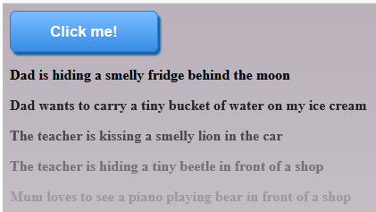

# Mum is hiding

This project contains a Spring Boot application that generates funny sentences like 'Mum is hiding an enormous beetle behind the moon'.
It can be deployed as a Docker container via a build with the Maven Jib plugin.

## Getting Started

### Prerequisites

Git, Maven and Docker are required to download, build and run the project. Without docker it can be run from an IDE.

### Installing

```
git clone https://github.com/Darkwyng/mum-is-hiding.git
cd mum-is-hiding
mvn compile jib:dockerBuild
docker run -v /a/folder/in/your/system/:/data/ mum-is-hiding
```
Replace `/a/folder/in/your/system/` by a path that really exists.

If all worked, you can access the application at [http://localhost:8080/](http://localhost:8080/).



As it is written now, it will run on a Raspberry Pi 3. For other systems you may need to adapt the base docker image in [pom.xml](pom.xml).

## Configuration

You can change the words it uses by copying and adapting the files from `src/main/resources/com/pim/mum/` to the path you defined in the docker command. The words in the repository's files will be used as a fallback, until you have done this.

## License

This project is licensed under the MIT License - see the [LICENSE.md](LICENSE.md) file for details.
